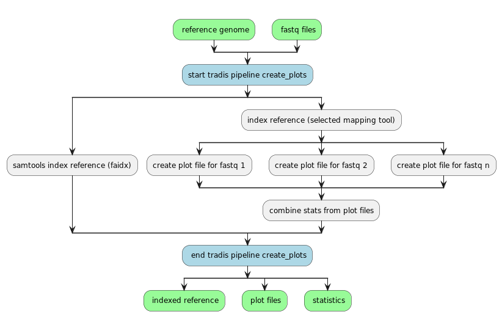

# QuaTraDIS (Quadram TraDIS)

A set of tools to analyse the output from Transposon Directed Insertion Sequencing (TraDIS) experiments.

 
[](https://app.travis-ci.com/github/quadram-institute-bioscience/QuaTradis) 
[](https://hub.docker.com/r/sbastkowski/quatradis)
[](http://bioconda.github.io/recipes/quatradis/README.html)
[](https://anaconda.org/bioconda/quatradis)
[](https://github.com/quadram-institute-bioscience/QuaTradis/blob/master/LICENSE) [](https://doi.org/10.1093/bioinformatics/btw022)  
<!--
[](https://codecov.io/gh/sanger-pathogens/bio-tradis)
-->
## Contents
  * [Introduction](#introduction)
  * [Installation](#installation)
    * [From source](#from-source)
    * [From bioconda](#from-bioconda)
    * [From docker](#from-docker)
  * [Usage](#usage)
    * [Scripts](#scripts)
    * [Functions](#functions)
    * [Docker](#docker)
  * [Contributing](#contributing)
    * [Building QuaTradis](#building-quatradis-from-source)
    * [Running unit tests](#running-unit-tests)
    * [Versioning](#versioning)
    * [CI](#ci)
  * [License](#license)
  * [Feedback/Issues](#feedbackissues)
  * [References](#references)
  * [Citation](#citation)

## Introduction 

The QuaTraDIS pipeline provides software utilities for the processing, mapping, and analysis of transposon directed insertion 
sequencing data. The pipeline was designed with the data from the TraDIS sequencing protocol in mind, but should work 
with a variety of transposon directed insertion sequencing protocols as long as they produce data in the expected format.

The primary tools and pipelines in QuaTraDIS consume reads produced multiple TraDIS sequencing experiments to produce 
transposon insertion site plot files.  Typically this is then followed up with rapid large-scale comparative analysis of 
the plots whilst also predicting the impact of these insertion sites on nearby genes.  However, a variety of tools and functions
are available to further process, manipulate or analyse this data.  For a full list of functions see the [Usage](#usage)
section below.

For more information on the TraDIS method, see http://bioinformatics.oxfordjournals.org/content/32/7/1109 and 
http://genome.cshlp.org/content/19/12/2308.

## Installation

QuaTraDIS is designed to run on debian linux distros.  It may also run on other linux distros or MacOS but this has
not been tested.

There are multiple paths to installing QuaTraDIS depending on your use case.

- From source if you want to extend or debug functions
- From bioconda, for a simple installation and user experience
- From docker, if you want to guarantee you are using the exact official version (although it comes with a little extra complexity to run)

Each installation method is described below.

### From source

[](https://github.com/quadram-institute-bioscience/QuaTradis)
[](https://github.com/quadram-institute-bioscience/QuaTradis)
[](https://github.com/quadram-institute-bioscience/QuaTradis)
[](https://github.com/quadram-institute-bioscience/QuaTradis)  

QuaTradis has the following dependencies so install these first.  We provide some guidelines on how to install on a debian
based system here, but if you are using another OS the actual commands may vary.  Also you may wish to install some of
these packages through alternate methods, e.g. from source.  In which case you'll need to lookup and follow the 
instructions for each package instead of running the commands below.

* System packages:
  * git
  * bwa
  * smalt
  * make
  * gcc
  * python3
  * python3-pip
  * r >= 3.6

```bash
sudo apt-get update -qq && \
sudo apt-get install -y bzip2 default-jre gcc locales make python3-pip r-base unzip wget && \
sudo apt-get install -y bwa minimap2 smalt
```
  
With the core packages installed we also need some python packages.  These can be installed using pip as described here:

```bash
pip3 install Bio cython pysam numpy pytest-cov semantic-version snakeviz
```

Finally, we also need a few R packages:

```bash
sudo Rscript -e "install.packages('BiocManager')" -e "BiocManager::install()" -e "BiocManager::install(c('edgeR','getopt', 'MASS'))"
```


Next move to a location to which you want to put the source code then clone the github repo and create a development build:

```buildoutcfg
git clone https://github.com/quadram-institute-bioscience/QuaTradis.git
cd QuaTradis
make dev
```
QuaTradis scripts should now be available.


#### Troubleshooting installations on old distributions

Older distributions of linux such as ubuntu 18 come packaged with R 3.4.  In this case R packages such as MASS and EdgeR will not install correctly with the commands mentioned above.  In this case we would recommend updating to R 3.6+.  In this snippet we show how to update R to 4.  However be cautious as this snippet will uninstall the current version of R, so be sure this is what you want to do, or figure out another way of running the versions side by side.

```bash
sudo apt install libssl-dev libcurl4-openssl-dev libxml2-dev
sudo apt remove r-base* --purge
sudo apt-key adv --keyserver keyserver.ubuntu.com --recv-keys E298A3A825C0D65DFD57CBB651716619E084DAB9
sudo add-apt-repository 'deb https://cloud.r-project.org/bin/linux/ubuntu bionic-cran40/'
sudo apt update
sudo apt install r-base
```


### From Bioconda

[](https://anaconda.org/bioconda/quatradis)
[](https://anaconda.org/bioconda/quatradis)
[](https://anaconda.org/bioconda/quatradis)
[](https://anaconda.org/bioconda/quatradis)

Before installing QuaTraDIS via conda, first [install conda](https://docs.conda.io/projects/conda/en/latest/user-guide/install/linux.html) 
and enable the bioconda channel as described [here](https://bioconda.github.io/).  After which if you 
don't have mamba installed then we recommend you do this to make the installation process much faster.   
Rough steps are described here (adapt as needed for your system):

```bash
# We assume you already have conda installed with bioconda channel setup.  See comments above for details.

# Install mamba if you haven't already
conda install -c conda-forge mamba

# Install quatradis
mamba install -c conda-forge -c bioconda quatradis
```


Quatradis installs several conda dependencies, to avoid version mixups you might want to install QuaTraDIS in it's own

[conda virtual environment](https://docs.conda.io/projects/conda/en/latest/user-guide/tasks/manage-environments.html).  
To do this instead of running the commands above which install QuaTraDIS to your base environment you can install into
an environment called 'quatradis_env' (can be renamed to whatever you like) like so:

```bash
# Install mamba if you haven't already.  Its necessary to install this in the base environment
conda install -c conda-forge mamba

# Create the virtual environment
conda create --name quatradis_env

# Activate the virtual environment
conda activate quatradis_env

# Install quatradis
mamba install -c conda-forge -c bioconda quatradis

# For now to workaround an issue with the bioconda recipe it may be required to install the latest pysam version as 
# sometimes an old incompatible version gets installed
mamba install -c conda-forge -c bioconda pysam=0.19.1
```

Remember that if using virtual environments you will need to activate it everytime prior to using QuaTraDIS:

```bash
# Activate the virtual environment called quatradis
conda activate quatradis_env

# Run your tradis command...
tradis <arguments and options>

# If you need to deactivate the venv, either just close your terminal session or explicitly type
conda deactivate
```


### From Docker

[](https://hub.docker.com/r/sbastkowski/quatradis)
[](https://hub.docker.com/r/sbastkowski/quatradis)
[](https://hub.docker.com/r/sbastkowski/quatradis)  

QuaTradis can be run in a Docker container. First install Docker, then pull the QuaTraDIS image from dockerhub:

    docker pull sbastkowski/quatradis

if you wish to use a specific version, check what tags are available in [dockerhub](https://hub.docker.com/r/sbastkowski/quatradis) 
and add `:<tagversion>` to the previous command (replacing with whatever version you wish to use).


## Usage

QuaTraDIS creates a single executable tool called `tradis`, all functions are available within this tool and can therefore be
used in many different ways.  However, a typical use case maybe be to first convert your TraDIS sequenced reads into 
transposon insertion site plot files.  This can be done with a command line such as this below, which has each fastq
file (optionally gzipped) listed in `my_fastq_list.txt`:

```bash
tradis pipeline create_plots --output_dir plots_output my_fastq_list.txt my_reference.fasta
```

The output will be a series of directories for each fastq, containing the plot file for each sequence in the given reference,
along with the aligned reads, and some statistics regarding transposon insertion sites both for each sample, and across
all samples.  The workflow for `tradis pipeline create_plots` is shown in this diagram:



A set of plot files can then be analysed in relation to each other using the `tradis pipeline compare` command.  For example:  

```bash
tradis pipeline compare --output_dir analysis_output --annotations my_annotations.embl \
  --condition_files cond1.fq.gz cond2.fq.fz \
  --control_files cont1.fq.gz cont2.fq.gz 
```

The workflow for `tradis pipeline compare` is shown in this diagram:


The `tradis` tool has multiple functions, as shown below, and can also be found using the tools help message `tradis --help`:

* `pipeline`
  * `create_plots` - Creates transposon insertion site plot files from multiple fastq files.  This uses a snakemake pipeline and is capable of distributing work over a cluster, running in parallel where possible.
  * `compare` - Comparative analysis of multiple plot files across controls, conditions and replicates.  Predicts impact of inserts on nearby genes.
* `plot`
  * `create`
    * `from_fastq` - From a fastq file and reference, maps the reads to the reference and produces the transposon insertion site plot files.
    * `from_alignments` - From pre-mapped reads, creates the transposon insertion site plot file
  * `combine` - Combines several plots into 1.
  * `count` - Takes genome annotation in embl format along with plot files produced by "tradis pipeline" and generates tab-delimited files containing gene-wise annotations of insert sites and read counts.
  * `normalise` - Scales the insertion site counts of plot files based on the sample with the maximum number of reads. 
* `comparison`
  * `logfc_plot` - Run logfc analysis for a specific plot file direction: forward, reverse, combined, original over all experiments 
  * `presence_absence` - Take in gene report files and produce a heatmap
  * `figures` - Create graphics of controls vs conditions
  * `gene_report` - Generate gene report from logfc_plot analysis data
  * `split` - Splits a plot file into forward only, reverse only and combined plot files.
  * `essentiality` - Determines how essential each gene is based on the transposon insertion sites
  * `essentiality_analysis` - Compares essentiality across condition and control samples
  * `prepare_embl` - Prepares an embl annotations file for comparative analysis from a plotfile. If an existing embl file is supplied then genes in that file are expanded based on data from the plot file
* `utils`
  * `index` - Indexes a reference using the specified alignment tool
  * `extract_names` - Creates a file containing the sequence names in a fasta file
  * `annotation` - Take in an EMBL file and add flanking 3 prime and 5 prime annotation.
  * `artemis_project` - Create an artemis project file.  Sometimes you want to view the insert site plots in Artemis. It can be quite a manual task to open up different replicates and combinations. This script will generate a project.properties file from a spreadsheet which gets automatically loaded by Artemis (from the current working directory). This then makes it quicker to view multiple different insert site plots.
  * `tags`
    * `add` - Generates a BAM file with tags added to read strings.
    * `check`- Prints 1 if tags are present in alignment file, prints 0 if not.
    * `filter` - Create a fastq file containing reads that match the supplied tag.
    * `remove` - Creates a fastq file containing reads with the supplied tag removed from the sequences.
  
A help menu for each script can be accessed by running the script by adding with "--help".  While perusing these tools,
note that default parameters are set for comparative experiments, and will need to be modified for gene essentiality studies.


### Functions

The functions behind the command line tools described above are available for use in the `quatradis` python package.  Details of using 
these functions is beyond the scope of this document and left to individual developers to figure out.  Please contact the core
QuaTraDIS developers in case you wish to collaborate on new features or just wish to find out more.


### Docker

The QuaTraDIS docker image is recommended for production use.  This is because docker containers allows 
for better portability and repeatability when compared to a direct installation from source, or even from python packages.  
For example, if running QuaTraDIS over multiple nodes in a cluster, in different environments, or if you want to repeat 
an experiment some time in the future, docker ensures the complete software configuration is exactly the same each time. 

An example docker command might look like this:

```bash
    docker run --rm -it -u $(id -u ${USER}):$(id -g ${USER}) -v /home/ubuntu/data:/data sbastkowski/quatradis tradis <program args>
```

To explain what is happening here you should familiarise yourself with [docker](https://docs.docker.com/engine/reference/commandline/run/) 
if you haven't already.  But a quick summary is:
- `--rm` Remove the container after it has completed.
- `-it` Run in an interactive terminal session
- `-u $(id -u ${USER}):$(id -g ${USER})` Run container as the current host user.  This stops all generated files being owned by root.
- `-v /home/ubuntu/data:/data` Mount the local directory `/home/ubuntu/data` to `/data` in the container.  Change the first half of the parameter as necessary to mount in your data files.
- `sbastkowski/quatradis` The QuaTraDIS docker image path from dockerhub

Replace `<program args>` with whatever command line arguments whatever arguments make sense for your case.  Keep in mind
that any file paths need to reference the paths inside the container, not those on the host, e.g. /data/<your file>

Once you have something that works for you, then making a simple wrapper script can help simplify future usage.

### Running pipelines on a cluster

Because the pipeline functions use snakemake it is possible to execute each stage as a separate scheduled job.  Furthermore, 
it is possible to run each job in its own docker container if so configured.  This enables us to scale by distributing 
work across a cluster, whilst still guaranteeing reproducibility.  This behaviour can be achieved by providing a custom 
snakemake profile to the `tradis pipeline` function.  Details of how to do this are left to the user for now.


## Contributing

QuaTraDIS uses git for version control, with its public repo sited on [github](https://github.com/quadram-institute-bioscience/QuaTradis/tree/master).  
Contributions go through a standard feature branch workflow, so for most users this means that changes should be created 
in a feature branch off of the default master branch.  Changes are merged into `master` by submitting a 
[github pull request](https://github.com/quadram-institute-bioscience/QuaTradis/pulls).  

Before submitting the PR please check that your code changes pass all unit tests (see below) to save time.  Also ideally 
write some unit tests to cover your new functionality.  PRs require 1 approval from an admin as well as a successful travis 
build before the PR can be merged.

### Building QuaTraDIS from source

QuaTraDIS is mostly python code, managed with [setuptools](https://pythonhosted.org/an_example_pypi_project/setuptools.html), 
so all the usual methods for building python via this method apply.  However, to make things simpler a 
[Makefile](Makefile) is provided which various targets for some common actions a developer might want to take.  For example 
if you want to build a development release type `make dev`.  If you would like to install into your local python environment
type `make install`.  A local docker image can be built by typing `make docker-build`.

### Running unit tests

The suite of unit tests can be run with `make test` from the top-level directory.  Alternatively you can run `pytest` 
directly from the `tests` directory.

### CI

[](https://github.com/quadram-institute-bioscience/QuaTradis/actions/workflows/create_release.yml)

Continuous integration is delivered via [Github Actions](https://github.com/quadram-institute-bioscience/QuaTradis/actions).
There are two pipelines in the [.github/workflows](.github/workflows) directory.  One will build and test QuaTradis on 
any branch except for master.  The status of these builds should be checked before any PRs or merges are applied into the
master branch.  For commit to the `master` branch no builds are executed by default, however if a git tag is applied, 
then not only is this commit built and tested, but also the docker image is published to dockerhub.  See the next section
for details on how we recommend tags are applied using semantic versioning.

### Versioning

[](https://github.com/quadram-institute-bioscience/QuaTradis)  

When administrators (as defined by github) feel it is time to create a new release and bump the version there are 3 different
make targets to choose from depending on which kind of release is required:

- Major release: `make release_major`
- Minor release: `make release_minor`
- Patch release: `make release_patch`

However, before running these commands make sure you have the `dev` python packages installed otherwise these will fail.  
You can do this by typing: `pip install quatradis[dev].`


For details of what each of these do see the [Makefile](Makefile) but this increases the dot release number
in the [VERSION](VERSION) file and commits this to the `master` branch and pushes it to github.  The new master commit 
is tagged appropriately with the new version.  This then triggers travis to build and publish a docker image to dockerhub.

If administrators need help figuring out which release number to bump then check the [semver2](https://semver.org/) guidelines. 


## License
QuaTradis is free software, licensed under [GPLv3](LICENSE).


## Feedback/Issues
Please report any issues to the [issues page](https://github.com/quadram-institute-bioscience/QuaTradis/issues), or contact
the [developers](AUTHORS).


## References

QuaTraDIS is built on top of the work done in BioTraDIS and AlbaTraDIS:

- [TraDIS Toolkit](https://bioinformatics.oxfordjournals.org/content/32/7/1109)
- [AlbaTraDIS: Comparative analysis of large datasets from parallel transposon mutagenesis experiments](https://doi.org/10.1101/593624)


## Citation

The QuaTraDIS academic paper is currently work in progress.  For now please cite the references above.